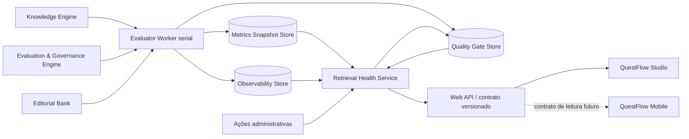

# QuestFlow 6.11.0 — Retrieval Health Service

## Objetivo

Separar Observabilidade de Retrieval e Quality Gates do AI Engine sem criar um sétimo motor pedagógico. O Retrieval Health Service é uma camada transversal de infraestrutura/qualidade, responsável por avaliação, snapshots, promoção e auditoria do retrieval.

## Arquitetura

## Fronteiras

### Seis motores pedagógicos preservados

O QuestFlow continua com os mesmos seis motores. `RetrievalHealthService` não entra no registry de engines e não participa diretamente de recomendação, FSRS, learner model, geração de questões ou cálculo de desempenho do aluno.

### Query side

Consultas de Observabilidade e Quality Gates são somente leitura:

- não executam benchmark;
- não consultam o índice vivo para recalcular métricas;
- não gravam snapshot;
- devolvem apenas o último estado persistido no Metrics Snapshot Store/Quality Gate Store.

### Command side

Uma reavaliação explícita cria um job no Evaluator Worker. O worker possui concorrência máxima 1, evitando duas avaliações simultâneas sobre bases diferentes.

Fluxo:

1. cria/persiste o job;
2. executa `MultimodalGroundingBenchmark` uma única vez;
3. captura o snapshot do índice uma única vez;
4. associa um `evaluation_id` único;
5. calcula Observabilidade e Quality Gate a partir do mesmo snapshot;
6. persiste ambos e o snapshot canônico;
7. marca o job como concluído.

Se ocorrer falha, o último snapshot válido permanece disponível e o job é registrado como `failed`.

## Contratos principais

### Snapshot canônico

Schema: `questflow.retrieval_health_snapshot.v1`

Contém, no mínimo:

- `evaluation_id`;
- release;
- data/hora;
- snapshot do benchmark;
- estado do índice;
- resultado do Quality Gate;
- indicador de consistência.

### Contrato de leitura

Schema: `questflow.retrieval_health_contract.v1`

É a fronteira recomendada para Studio e, futuramente, Mobile. Clientes não devem recalcular Score, Recall, Grounding, Coverage ou Drift.

### Semântica de ausência de amostra

Ausência de amostra é representada por `null`/`not_evaluated`, nunca por `0.0`. Assim, Programa e Aplicativo não confundem “não medido” com “resultado zero”.

## Endpoints/métodos de aplicação

Leitura:

- `get_retrieval_health_service`
- `get_retrieval_health_snapshot`
- `get_retrieval_observability`
- `get_retrieval_quality_gate`
- `get_retrieval_evaluation_job`

Comandos:

- `start_retrieval_evaluation`
- promoção de release usando gate persistido;
- override auditado usando gate persistido;
- rollback.

Os nomes legados de Observabilidade/Quality Gates permanecem como fachada de compatibilidade, mas agora roteiam para `RetrievalHealthService`, e não para `AIEngine`.

## Consistência Programa × Aplicativo

- O Studio é consumidor do snapshot, não calculador de métricas.
- O Mobile 0.7.3 permanece compatível e não recebe mudança obrigatória nesta release.
- A integração futura do Mobile deverá consumir o contrato canônico versionado em modo somente leitura.
- `evaluation_id` permite comprovar que Observabilidade e Quality Gates vieram exatamente da mesma avaliação.

## Isolamento operacional

Na 6.11.0, o serviço é isolado logicamente e executa avaliação em worker dedicado dentro do processo local do QuestFlow. Não foi criado um segundo processo/daemon do sistema operacional porque isso adicionaria IPC, instalação, supervisão e migração operacional sem benefício proporcional para o volume atual.

A fronteira criada permite, no futuro, mover o Evaluator Worker para processo separado sem alterar o contrato consumido por Studio/Mobile.

## Watchdog

`RetrievalHealthService` é registrado no supervisor como serviço não crítico. Falhas de avaliação são observáveis, mas não devem derrubar Study Session, banco editorial ou funções essenciais de estudo.

## Persistência

Arquivos de estado ficam no root de calibração/retrieval já existente, incluindo:

- `retrieval_health_snapshot.json`;
- `retrieval_health_service_state.json`;
- `retrieval_health_jobs.jsonl`.

Não há migração destrutiva de SQLite na 6.11.0.

## Recuperação

Na inicialização, jobs persistidos como `queued` ou `running` após encerramento inesperado são reparados para `interrupted`. Uma nova avaliação pode então ser iniciada sem deixar o serviço bloqueado.
